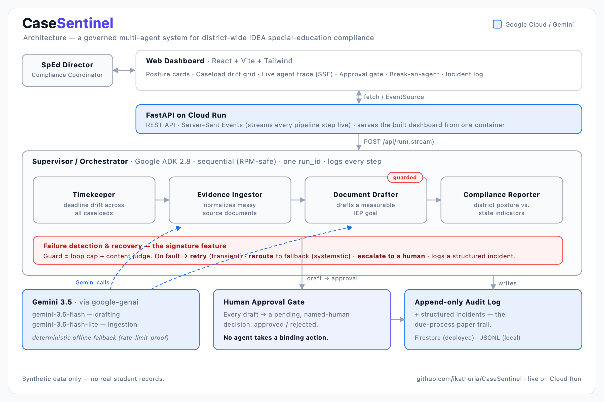
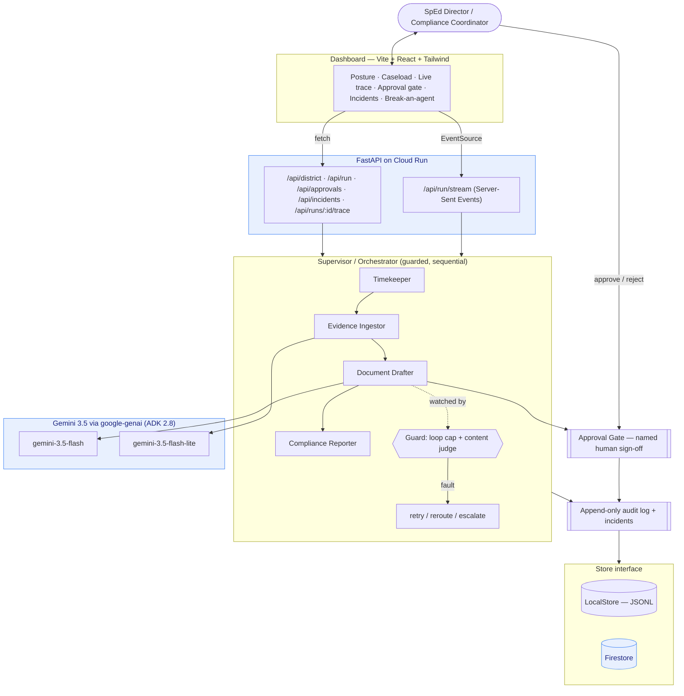

# 00 — Architecture Diagram

Rendered image (for slides / Devpost): [`casesentinel-architecture.png`](casesentinel-architecture.png)
(source: [`casesentinel-architecture.svg`](casesentinel-architecture.svg)).

---

Mermaid version:

**Data flow:** the director triggers a sweep → the supervisor runs the four agents
sequentially (RPM-safe) → the Document Drafter runs under a guard (loop cap +
content judge) → on failure the supervisor retries/reroutes/escalates and logs an
incident → the draft becomes a pending approval → a named human approves → every
step is written to the append-only audit log (LocalStore offline, Firestore on
Cloud Run). The dashboard streams the whole thing live over SSE.
